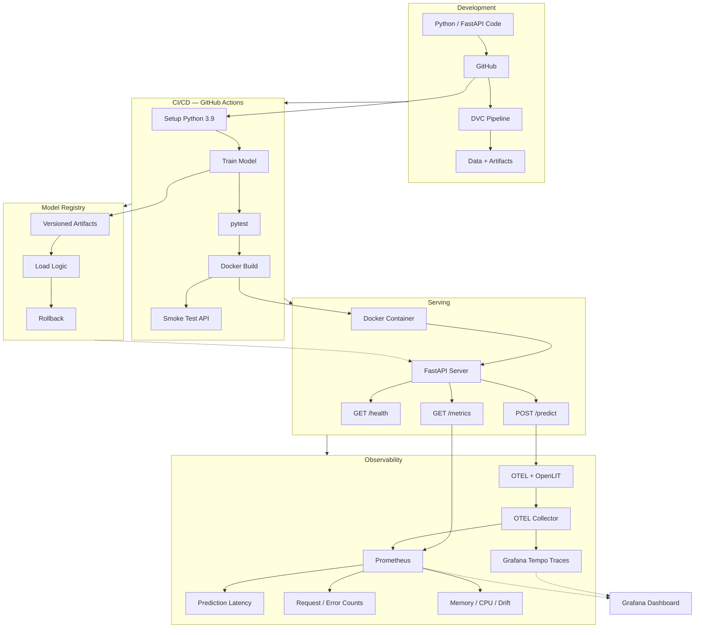

# MLOps Model CI/CD Pipeline

End-to-end ML lifecycle automation: versioned data pipelines, automated training via CI/CD, containerized deployment, and real-time monitoring with Prometheus.

**Stack**: `Python` · `FastAPI` · `Docker` · `GitHub Actions` · `DVC` · `Prometheus` · `OpenTelemetry` · `OpenLIT` · `Grafana` · `Tempo` · `Transformers` · `REST API`

---

## Architecture



## Capabilities

| Area | What It Does |
|---|---|
| **Data Versioning** | DVC tracks datasets and model artifacts outside Git, enabling reproducible pipelines |
| **Automated CI/CD** | GitHub Actions trains, tests, builds Docker images, and validates live endpoints on every push |
| **Model Registry** | Custom versioning system with deployment logic and rollback support |
| **REST API** | FastAPI with Pydantic validation, structured error handling, and health checks |
| **Containerization** | Docker + docker-compose for reproducible, portable deployment |
| **Observability** | Prometheus metrics + OpenTelemetry GenAI traces + OpenLIT auto-instrumentation + Grafana dashboards |
| **Testing** | 4-tier test pyramid: unit, integration, model, and DVC pipeline tests |
| **Drift Detection** | Runtime feature drift analysis with Prometheus-exported drift gauges |

## Key Engineering Decisions

| Decision | Rationale |
|---|---|
| **Stateless API** | Horizontally scalable behind any load balancer; no session affinity needed |
| **In-memory model cache** | Singleton avoids per-request reload overhead |
| **Graceful degradation** | `/health` returns `degraded` when model is unavailable instead of crashing |
| **Request ID middleware** | Every request gets a UUID for traceability across logs, errors, and responses |
| **Pydantic input validation** | Malformed requests are rejected at the boundary before reaching model logic |
| **Prometheus histograms** | Latency percentiles (p50/p95/p99) are computable from `/metrics` |
| **OpenTelemetry traces** | Every LLM inference produces a GenAI semantic span with token counts, model name, and parameters |
| **OpenLIT auto-instrumentation** | Automatic LLM call tracing for supported providers without code changes |
| **Grafana + Tempo** | Unified dashboards for metrics and distributed traces |
| **Prompt-based LLM inference** | Supports any Hugging Face model via `MODEL_NAME` env variable |

## CI/CD Pipeline

Every push to `main` triggers:

1. **Setup** — Python 3.9, install dependencies
2. **Train** — `python src/train.py`, saves model to `artifacts/`
3. **Test** — `pytest tests/ -v` (unit, integration, model, DVC)
4. **Build** — `docker build` produces a production image
5. **Validate** — container starts, smoke-tests `/health` and `/predict`

## API

| Endpoint | Purpose |
|---|---|
| `GET /health` | Readiness check with model status and resource snapshot |
| `POST /predict` | LLM inference with configurable generation parameters |
| `GET /metrics` | Prometheus metrics in text format |
| `GET /drift-status` | Latest drift detection summary |
| `GET /docs` | Interactive Swagger UI |

**POST /predict**
```json
// Request                          // Response
{                                   {
  "prompt": "Hello",                  "generated_text": "...",
  "max_new_tokens": 100,              "model_version": "Qwen/Qwen2.5-0.5B-Instruct"
  "temperature": 0.7                }
}
```

## Observability

### How LLM Monitoring Is Implemented

The monitoring stack has three layers:

**1. Prometheus metrics** (built-in, no external deps)
- Exported at `GET /metrics` in OpenMetrics text format
- Every endpoint, prediction, error, drift scan, and resource sample updates counters/histograms/gauges
- The middleware (`app/main.py:236`) assigns a UUID to every request, measures latency, and increments `api_requests_total`, `api_request_duration_seconds`, `api_errors_total`, and `api_inflight_requests`
- Prediction metrics track latency (`ml_prediction_duration_seconds`), output length distribution (`ml_prediction_class_distribution_total`), and failure reasons (`ml_prediction_errors_total`)

**2. OpenTelemetry GenAI spans** (`app/main.py:366`)
- Every `/predict` call wraps `model.generate()` in an OTel span named `"chat"`
- The span carries standard GenAI semantic convention attributes (`gen_ai.*`): provider, model name, input/output token counts, temperature, top_p, top_k, max_tokens, finish reason
- These attributes enable TraceQL queries like `{ gen_ai.usage.output_tokens > 500 }` in Grafana Tempo
- The tracer provider (with `BatchSpanProcessor` + `OTLPSpanExporter`) is initialized at startup and sends spans to the OTEL collector

**3. OpenLIT auto-instrumentation** (`app/main.py:97`)
- `openlit.init()` at startup auto-patches supported LLM SDKs to emit OTEL traces without per-call code changes
- Content capture is disabled by default (`disable_content_capture=True`) for privacy — prompt/response payloads are not shipped to the backend

**Telemetry pipeline:**
```
FastAPI /predict  ──OTLP──►  OTEL Collector  ──►  Tempo (traces)
                         │
                         └──►  Prometheus (metrics)
                                  │
                                  ▼
                              Grafana Dashboard
```
The app degrades gracefully if the collector is unreachable (try/except in `setup_telemetry`).

### Prometheus Metrics

| Metric | Type | Labels | Description |
|---|---|---|---|
| `ml_predictions_total` | Counter | — | Total predictions served |
| `ml_prediction_duration_seconds` | Histogram | — | Prediction latency distribution |
| `ml_prediction_errors_total` | Counter | `reason` | Inference failures by reason |
| `ml_prediction_class_distribution_total` | Counter | `class_name` | Output length (short/medium/long/empty) |
| `api_requests_total` | Counter | `method`, `endpoint`, `status` | Request volume |
| `api_request_duration_seconds` | Histogram | `method`, `endpoint` | API latency by route |
| `api_errors_total` | Counter | `method`, `endpoint`, `exception_type` | Unhandled exceptions |
| `api_inflight_requests` | Gauge | — | Concurrent request count |
| `ml_model_load_total` | Counter | `status` | Model load attempts |
| `ml_model_loaded` | Gauge | — | 1 = loaded, 0 = not loaded |
| `ml_drift_detected` | Gauge | — | 1 if drift detected, 0 otherwise |
| `ml_drifted_feature_count` | Gauge | — | Number of drifted features |
| `process_memory_rss_bytes` | Gauge | — | Resident memory |
| `process_cpu_percent` | Gauge | — | CPU usage |
| `process_thread_count` | Gauge | — | Thread count |
| `service_uptime_seconds` | Gauge | — | Process uptime |

### OpenTelemetry GenAI Traces

Every `/predict` produces a `chat` span with these attributes:

| Attribute | Source | Purpose |
|---|---|---|
| `gen_ai.operation.name` | Hardcoded: `"chat"` | Identifies GenAI operation type |
| `gen_ai.provider.name` | Hardcoded: `"huggingface"` | LLM provider identifier |
| `gen_ai.request.model` | `MODEL_NAME` env var | Model requested by the client |
| `gen_ai.request.max_tokens` | `req.max_new_tokens` | Generation length limit |
| `gen_ai.request.temperature` | `req.temperature` | Sampling temperature |
| `gen_ai.request.top_p` | `req.top_p` | Nucleus sampling threshold |
| `gen_ai.request.top_k` | `req.top_k` | Top-k sampling |
| `gen_ai.usage.input_tokens` | `len(inputs.input_ids[0])` | Prompt token count (cost driver) |
| `gen_ai.usage.output_tokens` | `len(generated_tokens)` | Generated token count (cost driver) |
| `gen_ai.response.model` | `MODEL_NAME` env var | Model that actually served |
| `gen_ai.response.finish_reasons` | `["stop"]` | Why generation finished |

### OpenLIT Auto-instrumentation

[OpenLIT](https://github.com/openlit/openlit) automatically captures traces for supported SDKs (OpenAI, Anthropic, Hugging Face, LangChain, LlamaIndex, etc.) without any per-call code.

### Grafana + Tempo Dashboard

Run the full stack:
```bash
docker-compose up --build
```

| Service | URL | Purpose |
|---|---|---|
| API | `http://localhost:8000` | FastAPI prediction endpoints |
| Grafana | `http://localhost:3000` | Dashboards (no login) |
| Prometheus | `http://localhost:9090` | Metrics |
| Tempo | `http://localhost:3200` | Distributed traces |

## Testing

```
Unit Tests  →  Integration Tests  →  Model Tests  →  DVC Tests  →  CI/CD Smoke Tests
```

Every layer validates the pipeline from individual components through to the deployed container.

## Quick Start

```bash
git clone <repo-url>
cd mlops-model-ci-cd
bash setup_env.sh
source .venv/Scripts/activate
dvc repro                  # Train model
pytest tests/ -v           # Run tests
uvicorn app.main:app --reload  # Start API
```

## Docker

```bash
docker-compose up --build
```

## Documentation

| Guide | Description |
|---|---|
| [Architecture Deep Dive](docs/architecture.md) | Component diagrams, data flow, technology choices |
| [API Reference](docs/api.md) | Full endpoint documentation with examples |
| [CI/CD Pipeline](docs/ci-cd.md) | Workflow stages and local simulation |
| [Setup Guide](docs/setup.md) | Installation, configuration, troubleshooting |
| [Monitoring](docs/monitoring.md) | Metrics reference and health checks |
| [DVC Guide](docs/dvc.md) | Data versioning commands and best practices |
| [Model Registry](docs/model-registry.md) | Versioning, deployment, rollback |

## License

MIT
