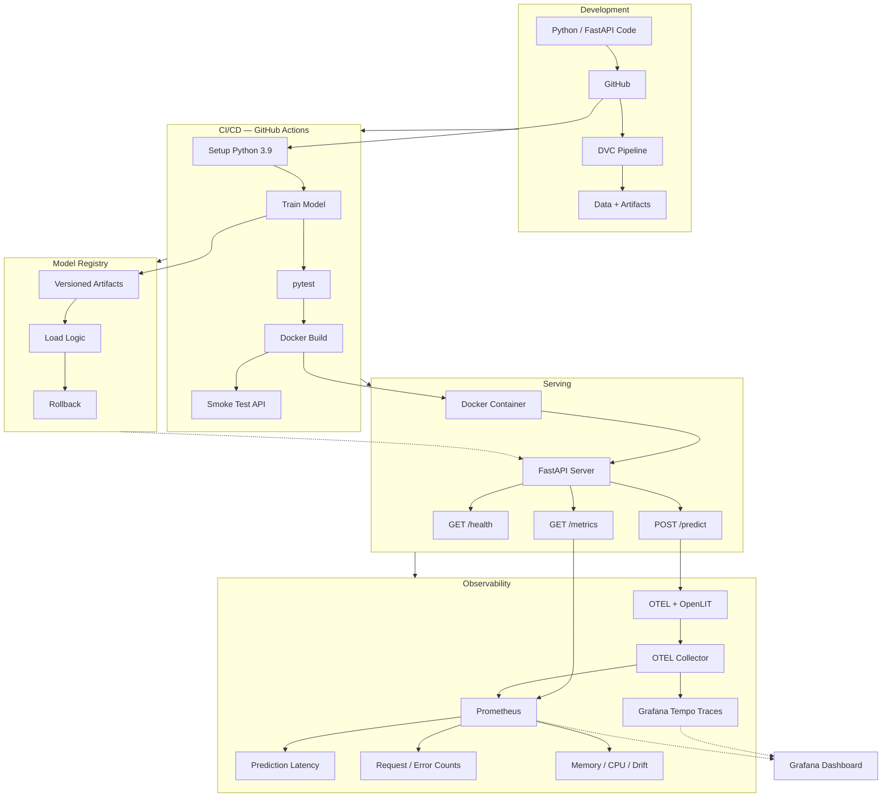

# MLOps Model CI/CD Pipeline

End-to-end ML lifecycle automation: versioned data pipelines, automated training via CI/CD, containerized deployment, and real-time monitoring with Prometheus.

**Stack**: `Python` · `FastAPI` · `Docker` · `GitHub Actions` · `DVC` · `Prometheus` · `OpenTelemetry` · `OpenLIT` · `Grafana` · `Tempo` · `Transformers` · `REST API`

---

## Architecture



## Capabilities

| Area | What It Does |
|---|---|
| **Data Versioning** | DVC tracks datasets and model artifacts outside Git, enabling reproducible pipelines |
| **Automated CI/CD** | GitHub Actions trains, tests, builds Docker images, and validates live endpoints on every push |
| **Model Registry** | Custom versioning system with deployment logic and rollback support |
| **REST API** | FastAPI with Pydantic validation, structured error handling, and health checks |
| **Containerization** | Docker + docker-compose for reproducible, portable deployment |
| **Observability** | Prometheus metrics + OpenTelemetry GenAI traces + OpenLIT auto-instrumentation + Grafana dashboards |
| **Testing** | 4-tier test pyramid: unit, integration, model, and DVC pipeline tests |
| **Drift Detection** | Runtime feature drift analysis with Prometheus-exported drift gauges |

## Key Engineering Decisions

| Decision | Rationale |
|---|---|
| **Stateless API** | Horizontally scalable behind any load balancer; no session affinity needed |
| **In-memory model cache** | Singleton avoids per-request reload overhead |
| **Graceful degradation** | `/health` returns `degraded` when model is unavailable instead of crashing |
| **Request ID middleware** | Every request gets a UUID for traceability across logs, errors, and responses |
| **Pydantic input validation** | Malformed requests are rejected at the boundary before reaching model logic |
| **Prometheus histograms** | Latency percentiles (p50/p95/p99) are computable from `/metrics` |
| **OpenTelemetry traces** | Every LLM inference produces a GenAI semantic span with token counts, model name, and parameters |
| **OpenLIT auto-instrumentation** | Automatic LLM call tracing for supported providers without code changes |
| **Grafana + Tempo** | Unified dashboards for metrics and distributed traces |
| **Prompt-based LLM inference** | Supports any Hugging Face model via `MODEL_NAME` env variable |

## CI/CD Pipeline

Every push to `main` triggers:

1. **Setup** — Python 3.9, install dependencies
2. **Train** — `python src/train.py`, saves model to `artifacts/`
3. **Test** — `pytest tests/ -v` (unit, integration, model, DVC)
4. **Build** — `docker build` produces a production image
5. **Validate** — container starts, smoke-tests `/health` and `/predict`

## API

| Endpoint | Purpose |
|---|---|
| `GET /health` | Readiness check with model status and resource snapshot |
| `POST /predict` | LLM inference with configurable generation parameters |
| `GET /metrics` | Prometheus metrics in text format |
| `GET /drift-status` | Latest drift detection summary |
| `GET /docs` | Interactive Swagger UI |

**POST /predict**
```json
// Request                          // Response
{                                   {
  "prompt": "Hello",                  "generated_text": "...",
  "max_new_tokens": 100,              "model_version": "Qwen/Qwen2.5-0.5B-Instruct"
  "temperature": 0.7                }
}
```

## Observability

### Prometheus Metrics

Exported at `GET /metrics`:

- **Latency**: `ml_prediction_duration_seconds` (histogram)
- **Volume**: `ml_predictions_total`, `api_requests_total` (counters)
- **Errors**: `api_errors_total`, `ml_prediction_errors_total` (counters by reason/type)
- **Model**: `ml_model_loaded` (gauge), `ml_model_load_total` (counter)
- **Drift**: `ml_drift_detected`, `ml_drifted_feature_count` (gauges)
- **Resources**: `process_memory_rss_bytes`, `process_cpu_percent`, `process_thread_count` (gauges)

### OpenTelemetry Traces (GenAI Semantic Conventions)

Every `/predict` LLM call produces a trace span with:

| Attribute | Value |
|---|---|
| `gen_ai.operation.name` | `chat` |
| `gen_ai.provider.name` | `huggingface` |
| `gen_ai.request.model` | Model name (e.g. `Qwen/Qwen2.5-0.5B-Instruct`) |
| `gen_ai.usage.input_tokens` | Prompt token count |
| `gen_ai.usage.output_tokens` | Generated token count |
| `gen_ai.request.temperature` | Sampling temperature |
| `gen_ai.request.top_p` | Top-p sampling |
| `gen_ai.request.top_k` | Top-k sampling |
| `gen_ai.request.max_tokens` | Max new tokens |
| `gen_ai.response.finish_reasons` | Completion reason |

### OpenLIT Auto-instrumentation

[OpenLIT](https://github.com/openlit/openlit) automatically instruments supported LLM SDK calls (OpenAI, Hugging Face, LangChain, etc.) and exports traces via OTLP.

### Grafana + Tempo Dashboard

Run the full stack with `docker-compose up` and open **`http://<deploy-host>:3000`** (default: `http://localhost:3000`, no login required) to see metrics and traces.

## Testing

```
Unit Tests  →  Integration Tests  →  Model Tests  →  DVC Tests  →  CI/CD Smoke Tests
```

Every layer validates the pipeline from individual components through to the deployed container.

## Project Structure

```
├── app/                    # FastAPI application
│   ├── main.py             # Routes, middleware, OTEL + OpenLIT instrumentation
│   └── schemas.py          # Pydantic request/response models
├── src/                    # ML logic
│   ├── train.py            # Model training
│   └── model_registry.py   # Versioning, load logic, rollback
├── tests/                  # Test suite
├── artifacts/              # Model storage (DVC-tracked)
├── grafana/                # Grafana provisioning
│   └── provisioning/
│       ├── dashboards/
│       └── datasources/
├── .github/workflows/      # CI/CD definitions
├── dvc.yaml                # DVC pipeline
├── Dockerfile              # Container image
├── docker-compose.yml      # Local deployment (API + OTEL + Tempo + Prometheus + Grafana)
├── otel-collector-config.yml
├── prometheus.yml
└── tempo.yml
```

## Quick Start

```bash
git clone <repo-url>
cd mlops-model-ci-cd
bash setup_env.sh
source .venv/Scripts/activate
dvc repro                  # Train model
pytest tests/ -v           # Run tests
uvicorn app.main:app --reload  # Start API
```

## Docker

```bash
docker-compose up --build
```

## Documentation

| Guide | Description |
|---|---|
| [Architecture Deep Dive](docs/architecture.md) | Component diagrams, data flow, technology choices |
| [API Reference](docs/api.md) | Full endpoint documentation with examples |
| [CI/CD Pipeline](docs/ci-cd.md) | Workflow stages and local simulation |
| [Setup Guide](docs/setup.md) | Installation, configuration, troubleshooting |
| [Monitoring](docs/monitoring.md) | Metrics reference and health checks |
| [DVC Guide](docs/dvc.md) | Data versioning commands and best practices |
| [Model Registry](docs/model-registry.md) | Versioning, deployment, rollback |

## License

MIT
