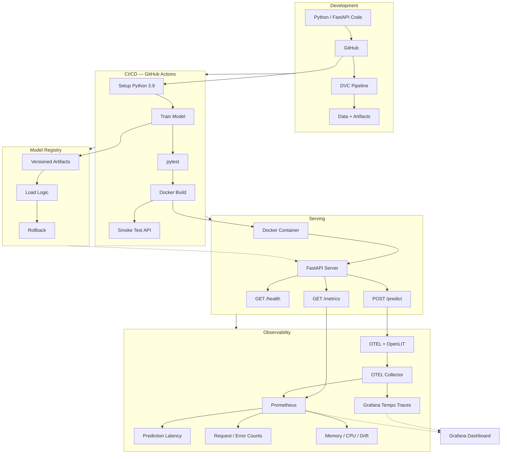

# MLOps Model CI/CD Pipeline

End-to-end ML lifecycle automation: versioned data pipelines, automated training via CI/CD, containerized deployment, and observability with Prometheus + OpenTelemetry + Grafana.

**Stack**: `Python` · `FastAPI` · `Docker` · `GitHub Actions` · `DVC` · `Prometheus` · `OpenTelemetry` · `OpenLIT` · `Grafana` · `Tempo` · `Transformers`

---

## Problem & Solution

Managing ML models in production is messy. Training is manual, deployments are copy-paste, and when inference breaks there is no visibility into why.

This repo automates the entire ML lifecycle so you can **train, deploy, serve, and observe** an LLM with a single `git push`.

| Problem | How the Repo Solves It |
|---|---|
| Training is manual and non-reproducible | DVC versioning + GitHub Actions trains on every push |
| No way to roll back a bad model | Model Registry versions artifacts with metadata; rollback is a pointer swap |
| Deploying is copy-paste | Docker + docker-compose gives repeatable deployment |
| No visibility into inference | Prometheus metrics (latency, errors, drift) + OpenTelemetry traces (token counts, model params) |
| Can't debug a bad prediction | Every request has a UUID; traces show exact model, params, tokens, and timing |
| Prompt-based LLMs need specific infra | FastAPI serves any Hugging Face model via `MODEL_NAME` env var |

## System Architecture



## How Components Connect

| Flow | Path |
|---|---|
| **Code → CI/CD** | Developer pushes to GitHub → GitHub Actions triggers train → test → build → smoke-test |
| **CI/CD → Registry** | Trained model artifacts are versioned in the Model Registry with metadata and rollback support |
| **CI/CD → Serving** | Docker image is built and deployed as a FastAPI server exposing `/predict`, `/health`, `/metrics` |
| **Serving → Observability** | `/predict` emits Prometheus metrics (latency, errors) and OpenTelemetry GenAI traces (token counts, model params) |
| **OTEL → Collector → Tempo** | OpenLIT + custom spans send traces via OTLP to the OpenTelemetry Collector, which forwards to Tempo for distributed tracing |
| **Collector → Prometheus** | The collector also exposes OTEL metrics as Prometheus-format endpoints |
| **Prometheus + Tempo → Grafana** | Grafana queries both for unified dashboards (request rate, latency percentiles, token usage, traces) |
| **Registry → Serving** | The active model version is loaded by the FastAPI server at startup |

## Quick Reference

| Endpoint | Purpose |
|---|---|
| `GET /health` | Readiness check with model status and resource snapshot |
| `POST /predict` | LLM inference with configurable generation parameters |
| `GET /metrics` | Prometheus metrics in text format |
| `GET /drift-status` | Latest drift detection summary |
| `GET /docs` | Interactive Swagger UI |

```bash
# Run full stack
docker-compose up --build

# Or run locally
uvicorn app.main:app --reload

# Query the API (set BASE_URL to your deployment, default: http://localhost:8000)
export BASE_URL="${BASE_URL:-http://localhost:8000}"
curl $BASE_URL/health
curl -X POST $BASE_URL/predict \
  -H "Content-Type: application/json" \
  -d '{"prompt": "What is MLOps?", "max_new_tokens": 50}'
curl $BASE_URL/metrics
```

| Service | Default URL |
|---|---|
| API | `{BASE_URL}` (default `http://localhost:8000`) |
| Grafana | `http://<deploy-host>:3000` (default `http://localhost:3000`) |
| Prometheus | `http://<deploy-host>:9090` |
| Tempo | `http://<deploy-host>:3200` |

## Docs

| Guide | Description |
|---|---|
| [Architecture](docs/architecture.md) | Component diagrams, data flow, technology choices |
| [API Reference](docs/api.md) | Full endpoint documentation with examples |
| [CI/CD Pipeline](docs/ci-cd.md) | Workflow stages and local simulation |
| [Setup Guide](docs/setup.md) | Installation, configuration, troubleshooting |
| [Monitoring](docs/monitoring.md) | Metrics, traces, OpenLIT, and dashboards |
| [DVC Guide](docs/dvc.md) | Data versioning commands and best practices |
| [Model Registry](docs/model-registry.md) | Versioning, deployment, rollback |
