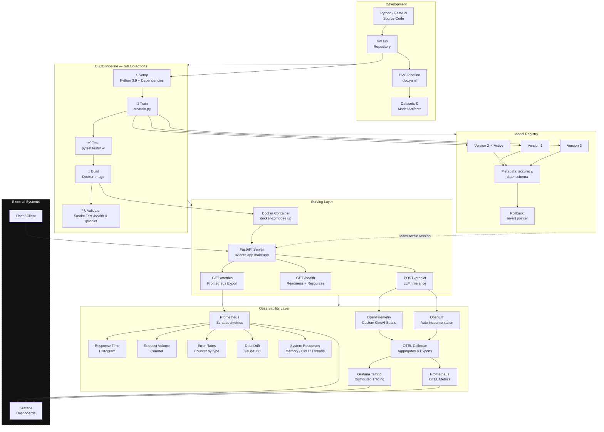
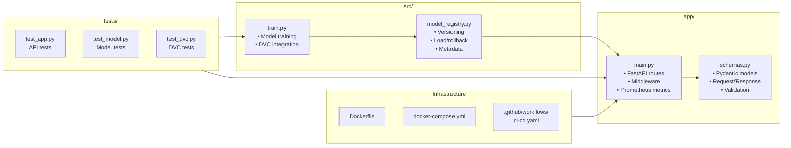

# Architecture

## System Overview



## Data Flow

```
┌──────────────┐     ┌──────────────────┐     ┌──────────────────┐
│   Developer  │────>│  GitHub Actions  │────>│  Model Registry  │
│   git push   │     │   ci-cd.yaml     │     │  versioned .pt   │
└──────────────┘     └──────────────────┘     └──────────────────┘
                             │                        │
                             │                        ▼
                             │               ┌──────────────────┐
                             │               │  FastAPI Server  │
                             │               │  /predict        │
                             └──────────────>│  /health         │
                                              │  /metrics        │
                                              │  OTel + OpenLIT  │
                                              └────────┬─────────┘
                                                       │
                                          ┌────────────┼────────────┐
                                          ▼            ▼            ▼
                                   ┌──────────┐ ┌──────────┐ ┌──────────┐
                                   │Prometheus│ │  OTEL    │ │  OpenLIT │
                                   │ /metrics │ │ Collector│ │ Auto-inst│
                                   └────┬─────┘ └────┬─────┘ └──────────┘
                                        │            │
                                        ▼            ▼
                                   ┌──────────┐ ┌──────────┐
                                   │ Grafana  │ │  Tempo   │
                                   │Dashboards│ │  Traces  │
                                   └──────────┘ └──────────┘
```

## Component Diagram



## Technology Choices

| Component | Choice | Why |
|---|---|---|
| **API Framework** | FastAPI | Async-native, automatic OpenAPI docs, Pydantic integration |
| **Model Serving** | Hugging Face Transformers | Industry standard for LLMs, broad model support |
| **CI/CD** | GitHub Actions | Native GitHub integration, free tier, large ecosystem |
| **Data Versioning** | DVC | Git-like semantics for data, pipeline reproducibility |
| **Monitoring** | Prometheus client + OpenTelemetry + OpenLIT | Standard metrics + GenAI semantic traces + auto-instrumentation |
| **Containerization** | Docker + Compose | Portable, reproducible, dev-prod parity |
| **Validation** | Pydantic v2 | Runtime type checking, JSON Schema generation |

## Key Design Properties

- **Stateless**: Each request is independent; scale horizontally with a load balancer
- **Observable**: Every operation is instrumented with metrics, logs, and request IDs
- **Resilient**: Graceful degradation, health checks, structured error handling
- **Reproducible**: DVC locks data and pipeline versions; Docker locks the runtime
- **Configurable**: Model, paths, and behavior controlled via environment variables
